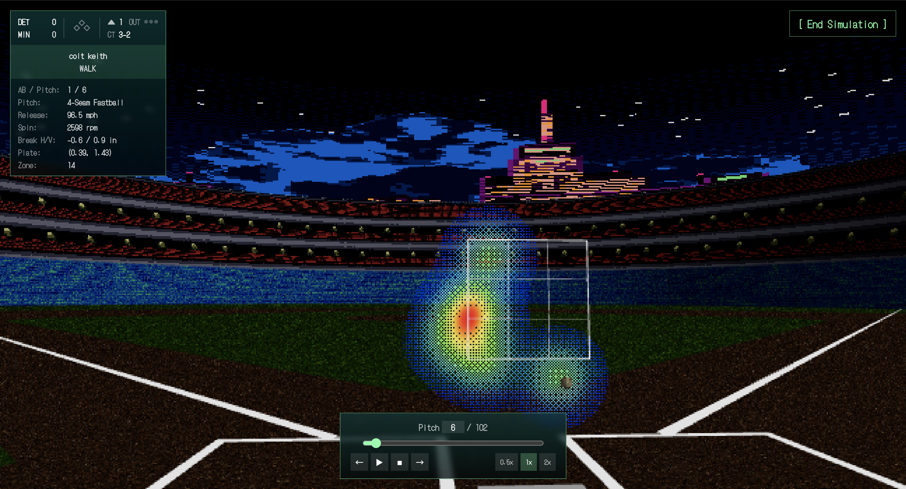

# Heatmap Simulation
 
A retro PS1-aesthetic 3D visualization of MLB pitch data. Pick a pitcher currently active this season and a game they pitched in. Watch every pitch thrown, with playback or slider, and see a heatmap progress in front of the strike zone.

<p align="center">
  
</p>

The aesthetic is deliberately PS1-era: chunky pixels, low polygon counts, vertex jitter, dithered transparency, bitmap fonts. The data is fully modern: pulled from MLB's Statcast feed via [pybaseball](https://github.com/jldbc/pybaseball), with trajectories computed from raw release velocities and accelerations. Hi-fi physics, lo-fi rendering.


## Features
 
- Select any active MLB pitcher
- Slide through every pitch with a Scorebug-style HUD showing count, outs, score, and pitch type
- Heatmap accumulates pitch locations on the strike zone, building a visual signature of the pitcher's performance
- Real Statcast pitch physics: release velocity, acceleration, plate crossing position
- PS1 visual aesthetic: vertex jitter, Bayer dithering, low-resolution rendering, bitmap fonts
- 3D baseball field geometry: infield wedge, foul lines, pitcher's mound, batter's boxes


## Tech Stack
 
| Layer        | Stack |
|--------------|-------|
| Frontend     | React, Vite, [react-three-fiber](https://github.com/pmndrs/react-three-fiber), [drei](https://github.com/pmndrs/drei), Three.js, Tailwind CSS, TanStack Query |
| Backend      | Java 21, Spring Boot, Spring Data JPA, Spring WebClient, Hibernate |
| Database     | PostgreSQL |
| Data Service | Python 3, FastAPI, pybaseball |


## Technical Highlights
 
A few things that were fun to figure out:
 
- **PS1 vertex jitter** — A custom `onBeforeCompile` hook patches three.js materials to snap vertex positions to a low-resolution grid in screen space, recreating the PS1-era integer-vertex wobble. Implemented as a callback-ref pattern so it works with async-loaded materials (textures, GLTFs).
- **Bayer ordered dithering** — The heatmap uses a 4×4 Bayer threshold matrix in the fragment shader to fake transparency through pixel stippling — authentic to the era, when real alpha blending was rare. A hard alpha cutoff before the dither pass eliminates edge artifacts from near-zero alpha pixels.
- **Statcast trajectory reconstruction** — Pitches are animated from raw Statcast kinematics (release position, initial velocity, acceleration in three axes) using a two-segment integration: release-to-y50 and y50-to-plate, solving for segment durations with the quadratic formula.
- **3D field geometry** — The infield is a `THREE.Shape` wedge with a grass hole carved out, built from computed arc intersections so the dirt extends just beyond the bases and the foul lines pass cleanly through home plate.


## Local Development
 
### Prerequisites
 
- Node.js 20+
- Java 21+
- Python 3.11+
- PostgreSQL 14+
- Maven (handled by the included `mvnw` wrapper)
### 1. Database
 
Create a database named `heatmapdata`:
 
```bash
psql -U postgres -c "CREATE DATABASE heatmapdata;"
```
 
Hibernate's `ddl-auto=update` creates the tables on first run.
 
### 2. Spring backend
 
```bash
cd pitch-heatmap-api
```
 
Create `src/main/resources/application-local.properties` with your DB credentials (this file is gitignored):
 
```properties
spring.datasource.url=jdbc:postgresql://localhost:5432/heatmapdata
spring.datasource.username=postgres
spring.datasource.password=YOUR_PASSWORD
spring.datasource.driver-class-name=org.postgresql.Driver
```
 
Run:
 
```bash
./mvnw spring-boot:run
```
 
Available at `http://localhost:8080`.
 
### 3. Python data service
 
```bash
cd pybaseball-service
python -m venv venv
source venv/bin/activate    # Windows: venv\Scripts\activate
pip install -r requirements.txt
uvicorn app:app --port 8000
```
 
Available at `http://localhost:8000`.
 
### 4. Frontend
 
```bash
cd front-end
npm install
npm run dev
```
 
Available at `http://localhost:5173`.


## Project Structure
 
```
.
├── front-end/                              # React + Vite + R3F
│   ├── public/
│   │   ├── textures/                       # Grass, dirt
│   │   └── models/                         # GLB assets
│   └── src/
│       ├── components/                     # UI, scenes, modals
│       ├── utils/                          # PS1 shader patches
│       ├── App.jsx
│       └── main.jsx
├── pitch-heatmap-api/                      # Java Spring Boot
│   └── src/main/java/com/pitchheatmap/pitch_heatmap_api/
│       ├── config/
│       ├── controller/                     # REST endpoints
│       ├── dto/                            # Request/response shapes
│       ├── model/                          # JPA entities
│       ├── repo/                           # JPA repositories
│       └── service/                        # Business logic
└── pybaseball-service/                     # Python FastAPI wrapper
    ├── app.py
    └── requirements.txt
```


## Roadmap
 
- **Containerization** — Docker Compose for one-command spin-up; deploy to a public URL
- **Scenery** — Outfield wall, stadium seats, city skyline backdrop, expanded field dimensions
- **Visual polish** — Pitcher/batter avatars, multiple stadium variants, day/night cycle


## Credits
 
All assets are CC0 (public domain).
 
- **Textures** — [Tiny Texture Pack](https://opengameart.org/content/tiny-texture-pack-1) on OpenGameArt
- **Baseball model** — [Old Baseball](https://opengameart.org/content/old-baseball) by LonesomeDucky on OpenGameArt
- **Skylines** — [Skyline Background](https://opengameart.org/content/skyline-background) by FabinhoSC on OpenGameArt
- **Brick wall** (outfield, side walls, backstop) — by **JosipKladaric** on OpenGameArt — CC-BY 3.0
- **Stadium stands** — [Stadium background (16 bit)](https://opengameart.org/content/stadium-background-16-bit) by **bcsilva** on OpenGameArt — CC-BY 3.0 *(modified: cropped)*

- **Fonts** — [VT323](https://fonts.google.com/specimen/VT323) and [DotGothic16](https://fonts.google.com/specimen/DotGothic16) via Google Fonts
- **Data** — [MLB Statcast](https://baseballsavant.mlb.com/) via [pybaseball](https://github.com/jldbc/pybaseball)